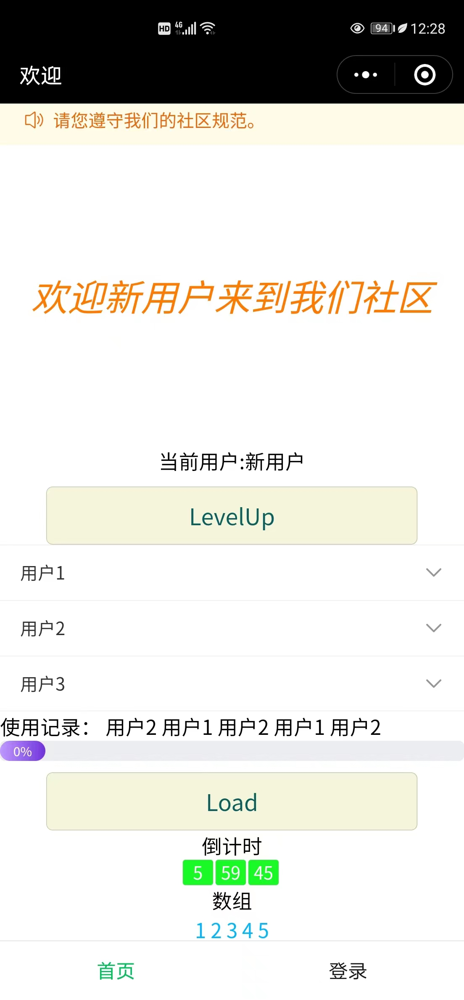
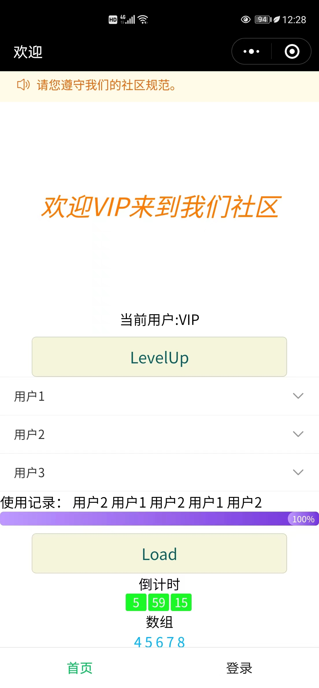

#微信小程序练习
# 页面布局

共使用了两个page，一个index，一个login，分别作为tabBar的两个页面。
## index页面



## login页面


# vant组件的使用
## index页面
```
  "usingComponents": {
    "van-notice-bar": "@vant/weapp/notice-bar/index",
    "van-count-down": "@vant/weapp/count-down/index",
    "van-button": "@vant/weapp/button/index",
    "van-progress": "@vant/weapp/progress/index"
  }
  ```
  即使用了通知栏，计时器，按钮，进度条

  倒计时部分代码
  ```
<van-count-down use-slot time="{{ time }}" bind:change="onChange">
  <text class="item">{{ timeData.hours }}</text>
  <text class="item">{{ timeData.minutes }}</text>
  <text class="item">{{ timeData.seconds }}</text>
</van-count-down>
  ```
进度条部分代码
index.wxml文件中
  ```
  <van-progress percentage="{{progressVal}}" pivot-text="{{progressVal}}%"  stroke-width="16" 
  color="linear-gradient(to right, #be99ff, #7232dd)"/>
<button bindtap="load" class="CommonBtn">Load</button>
  ```
index.js中
```
  load:function(){
    for(var i = 0; i <= 100; i++)
    {
      this.setData({progressVal:i})
    }
    
  }
```

## login页面
```
  "usingComponents": {
    "van-field": "@vant/weapp/field/index"
  }
```
即使用了输入框

部分代码
```
<van-cell-group>
  <van-field
    value="{{ username }}"
    required
    clearable
    label="用户名"
    icon="question-o"
    placeholder="请输入用户名"
    bind:click-icon="onClickIcon"
  />
```

# 数据绑定、动态修改、条件渲染、列表渲染、模板的使用
```
change:function(){
this.setData({array:[4,5,6,7,8]})
  },//对列表渲染的修改
  load:function(){
    for(var i = 0; i <= 100; i++)
    {
      this.setData({progressVal:i})//进度条加载数值
    }
    
  },
  levelUp: function() {
    this.setData({ user: "VIP" })//用户名修改
  }
  ```
  ```
  <view class="container">
 <p class="welcome">欢迎{{user}}来到我们社区</p>
</view>数据绑定及其修改

条件渲染
<view wx:if="{{user == '新用户'}}"> 新用户 </view>
<view wx:elif="{{user == 'VIP'}}"> VIP </view>

列表渲染-
<block wx:for="{{array}}"> {{item}} </block>
<button bindtap="change" class="CommonBtn">修改</button>

模板
<template name="printDetails">
  <view>
    Username: {{Username}}, Sex: {{Sex}}
  </view>
</template>

<template is="printDetails" data="{{...User1}}"></template>
<template is="printDetails" data="{{...User2}}"></template>
<template is="printDetails" data="{{...User3}}"></template>

模板加条件渲染，动态渲染
<template name="func1">
  <block> func1 </block>
</template>
<template name="func2">
  <block> func2 </block>
</template>
<block wx:for="{{[1, 2, 3, 4, 5]}}">
  <template is="{{item % 2 == 0 ? 'func1' : 'func2'}}"/>
</block>
  ```